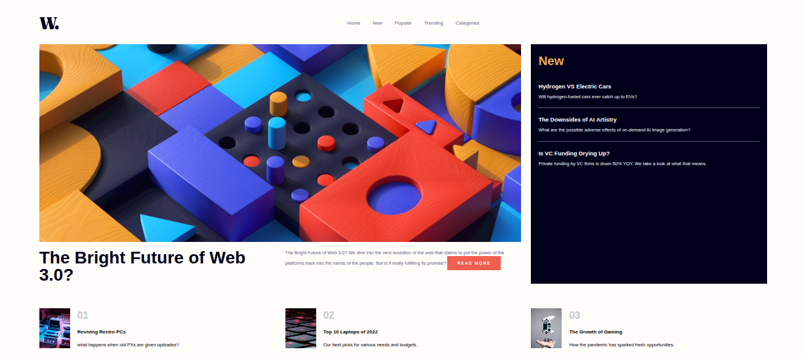

# Frontend Mentor - News homepage solution

This is a solution to the [News homepage challenge on Frontend Mentor](https://www.frontendmentor.io/challenges/news-homepage-H6SWTa1MFl). Frontend Mentor challenges help you improve your coding skills by building realistic projects.

## Table of contents

- [Overview](#overview)
  - [The challenge](#the-challenge)
  - [Screenshot](#screenshot)
  - [Links](#links)
- [My process](#my-process)
  - [Built with](#built-with)
  - [What I learned](#what-i-learned)
  - [Continued development](#continued-development)
  - [Useful resources](#useful-resources)
  - [AI Collaboration](#ai-collaboration)
- [Author](#author)
- [Acknowledgments](#acknowledgments)

## Overview

### The challenge

Users should be able to:

- View the optimal layout for the interface depending on their device's screen size
- See hover and focus states for all interactive elements on the page

### Screenshot



### Links

- Solution URL: [Add solution URL here](https://www.frontendmentor.io/solutions/kabidunewscraft-QSkmhoTxSs)
- Live Site URL: [Add live site URL here](https://freedev-group.github.io/News-homepage-kabidu/)

## My process

### Built with

- Semantic HTML5 markup
- CSS custom properties
- Flexbox
- CSS Grid
- Mobile-first workflow
- JavaScript

### What I learned

During this project, I deepened my understanding of responsive web design using CSS Grid and Flexbox. I also implemented a mobile navigation menu with JavaScript, learning about DOM manipulation and event listeners. Here's a code snippet from the JavaScript:

```js
menuToggle.addEventListener('click', () => {
  navLinks.classList.toggle('active');
  menuToggle.classList.toggle('open');
  body.style.overflow = navLinks.classList.contains('active') ? 'hidden' : 'auto';
});
```

### Continued development

In future projects, I plan to focus on improving my JavaScript skills, particularly in creating more interactive components and optimizing performance.

### Useful resources

- [Frontend Mentor](https://www.frontendmentor.io) - Excellent platform for practicing real-world frontend challenges.


### AI Collaboration
Copilot aided in completing this README by providing content ideas and markdown formatting.

## Author

- Frontend Mentor - [@Kabidu Munguakonkwa Sage](https://www.frontendmentor.io/profile/Abidusage)
- GitHub - [@kabidu Munguakonkwa Sage](https://github.com/Abidusage)

## Acknowledgments

Thanks to Frontend Mentor for providing this challenging project to practice frontend skills. Special thanks to the community for inspiration and feedback.